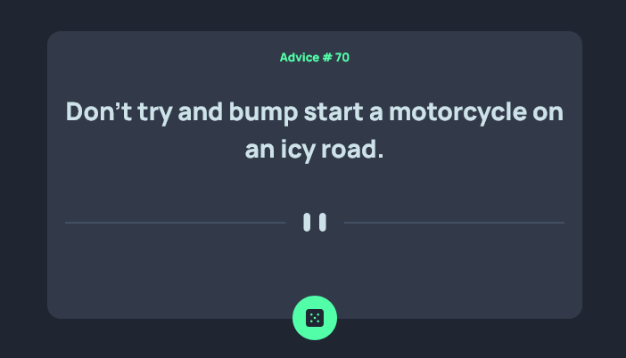

# Frontend Mentor - Advice generator app solution

This is a solution to the [Advice generator app challenge on Frontend Mentor](https://www.frontendmentor.io/challenges/advice-generator-app-QdUG-13db). Frontend Mentor challenges help you improve your coding skills by building realistic projects.

## Table of contents

- [Overview](#overview)
  - [The challenge](#the-challenge)
  - [Screenshot](#screenshot)
  - [Links](#links)
- [My process](#my-process)
  - [Built with](#built-with)
  - [What I learned](#what-i-learned)
- [Author](#author)
- [Acknowledgments](#acknowledgments)

## Overview

### The challenge

Users should be able to:

- View the optimal layout for the app depending on their device's screen size
- See hover states for all interactive elements on the page
- Generate a new piece of advice by clicking the dice icon

### Screenshot

### Links

- Solution URL: [Add solution URL here]() // to be added
- Live Site URL: https://randomadvicegeneratorapp.netlify.app 

## My process

### Built with

- Semantic HTML5 markup
- CSS custom properties
- Flexbox
- Vue 3

### What I learned

In relation to Javascript, this project helped me solidify my knowledge in calling API's and using async functions.
Building this project also made me more comfortably using the framework 'Vue'.

## Author

- Frontend Mentor - [@MarceloRodriguesOliveira](https://www.frontendmentor.io/profile/MarceloRodriguesOliveira)

## Acknowledgments

I would like to thank the FrontEnd Mentor community for their valuable support in helping me finish this project.

